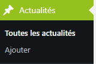
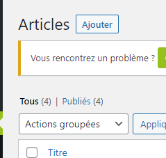

# Ajouter des Actualités : Informer vos Clients et Prospects

## Un Moyen Pratique de Communication

 

Ajouter des actualités à votre site vous permet de tenir vos clients et prospects informés sur les dernières nouvelles, événements ou promotions de votre entreprise.

Pour ajouter une nouvelle actualité, suivez ces étapes simples :

1. Cliquez sur l'option "Ajouter" dans le menu de gauche ou en haut de la page.

2. Remplissez les champs requis, tels que le titre, le contenu et éventuellement une image associée.

3. Personnalisez votre article en utilisant les fonctionnalités d'édition disponibles.

4. Une fois votre article prêt, enregistrez-le ou publiez-le selon vos besoins.

## Facilité de Création

Ajouter des actualités à votre site est un processus simple et rapide. Vous pouvez mettre à jour votre contenu régulièrement pour garder votre audience engagée et informée.

Besoin d'aide ? Contactez notre équipe technique à internet@meosis.fr.
