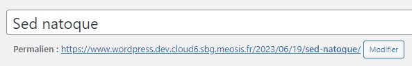
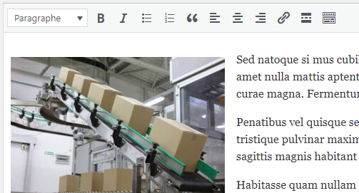
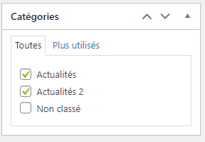
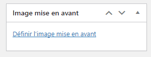

# Édition de l'Actualité

## Préparation du Contenu

Pour commencer l'édition de votre actualité, définissez d'abord un titre accrocheur qui reflète le sujet que vous souhaitez aborder.

Ensuite, rédigez le contenu de votre actualité. Dans ce cadre, similaire à un éditeur de texte classique, vous pouvez ajouter du texte, des titres, des images, des liens et même des listes à puces. N'oubliez pas que vous pouvez également styliser votre texte en gras ou en italique selon vos besoins.

## Attribution de Catégories

Après avoir rédigé le contenu, sélectionnez la catégorie appropriée qui correspond au sujet de votre actualité. Cela permettra à votre actualité d'apparaître au bon endroit sur votre site.

## Image à la Une

:::jerico-alert[Image à la Une]

N'oubliez pas d'ajouter une image mise en avant, qui servira d'illustration principale pour votre actualité et apparaîtra souvent en tête de celle-ci.
:::

## Publication de l'Actualité

Une fois tous les paramètres définis, vous pouvez publier votre actualité en cliquant sur le bouton correspondant dans le cadre de droite de l'écran. Si vous avez simplement effectué des modifications sur une actualité existante, assurez-vous de cliquer sur "Mettre à jour" pour sauvegarder vos changements.

:::success-jerico[Félicitations ! Vous venez de publier votre actualité !]

:::
\
Pour toute question ou assistance, n'hésitez pas à contacter notre service technique à l'adresse internet@meosis.fr.
