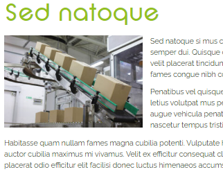

# Qu'est-ce qu'une Actualité ?

Les actualités font référence à ces articles pour communiquer des évènements, faits et informations du moment en lien avec l’entreprise.

## Comprendre le Concept

Une actualité est bien plus qu'un simple article ; c'est un moyen de communiquer efficacement avec vos clients et prospects. Ces publications présentent des événements, des faits et des informations récents liés à votre entreprise. Grâce à elles, vous avez la possibilité de partager des informations exclusives avec votre public, que ce soit à travers du texte, des images ou d'autres médias.

**Avantages pour le Référencement :** Les actualités dynamisent votre site en lui fournissant constamment de nouvelles informations. Cela permet à votre site de rester pertinent aux yeux des moteurs de recherche comme Google, contribuant ainsi à maintenir et améliorer son classement.

Pour une communication efficace et une meilleure visibilité en ligne, les actualités sont un outil essentiel à intégrer à votre stratégie de contenu.
