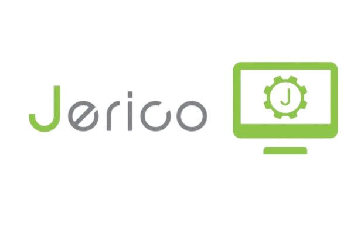

# Jerico 4.0 : Simplifiez la Modification de votre Site Web

## Qu'est-ce que Jerico ?

 

Jerico est un outil simplifié conçu par les équipes techniques de Meosis pour vous permettre de modifier facilement le contenu (textes et photos) de votre site web. Il offre également un accès pratique à toutes les informations essentielles pour suivre les performances de votre site.

:::info-jerico[Pourquoi Jerico 4.0 ?]

**Jerico 4.0** est la dernière version, la plus aboutie, qui a été pensée pour vous offrir une expérience de modification de site web encore plus fluide et intuitive. Grâce à Jerico 4.0, la prise en main de votre site est simplifiée, vous permettant d'effectuer des modifications rapidement et efficacement.
:::
\
Découvrez Jerico 4.0 et simplifiez la gestion de votre site web dès aujourd'hui !

