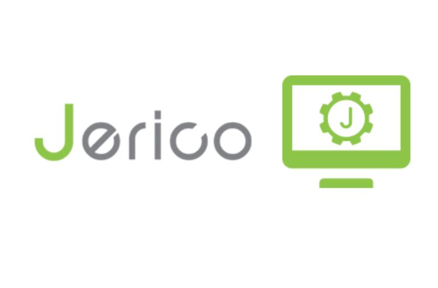

# Jerico 4.0

Qu'est-ce que l'outil Jerico ?

<iframe width="560" height="315" src="https://cdn.cluster014.hosting.meosis.fr/videos/meosis.fr/new-video-meosis.mp4" frameborder="0" allowfullscreen></iframe>

**JERICO 4.0**

Jerico est un outil simplifié pour vous permettre de modifier votre site web.

Conçu par les équipes techniques de Meosis, Jerico est un outil qui vous permet de modifier simplement le contenu (textes et photos) de votre site internet. Vous y retrouverez aussi toutes les informations utiles pour suivre les performances de votre site.

Jerico 4.0 est la dernière version, la plus aboutie, qui a été pensée pour vous faciliter la prise en main de votre site.
