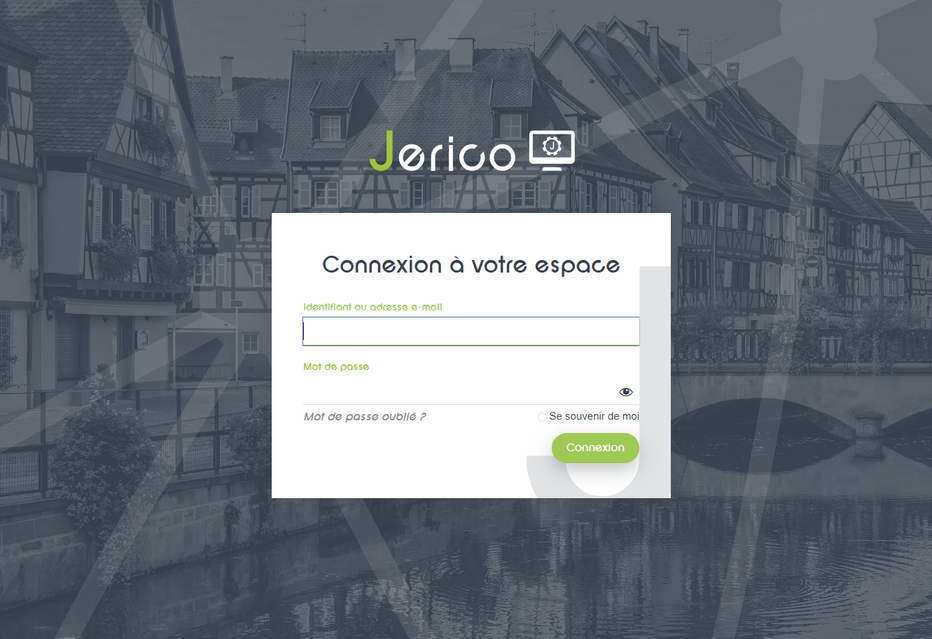
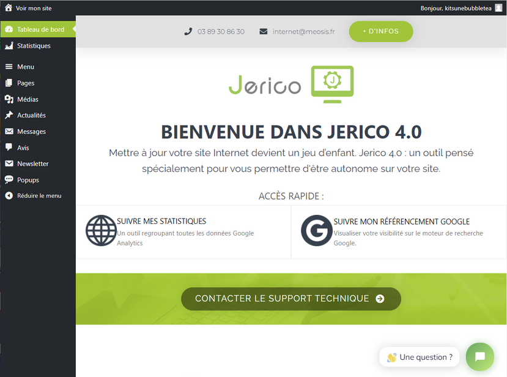

# Comment se connecter à Jerico ?

Bienvenue sur Jerico, votre espace sécurisé pour gérer vos données en toute simplicité !

## Se connecter

Pour vous connecter à Jerico, suivez ces étapes simples :

1. Rendez-vous sur votre site internet.
2. Ajoutez `/jerico` à l’adresse dans la barre de navigation. Par exemple : `https://votrenomdedomaine.fr/jerico`.
3. Une fois sur la page de connexion, saisissez votre identifiant et votre mot de passe fournis par le service technique.
4. Cliquez sur le bouton de connexion. 

:::success-jerico[Et voilà !]

Vous êtes maintenant connecté à Jerico et prêt à explorer ses fonctionnalités.

:::

## Interface Jerico

Découvrez les éléments du menu :

Une fois connecté à Jerico, vous serez accueilli par une interface conviviale et intuitive. Voici un aperçu rapide de ce que vous pouvez trouver dans le menu de navigation sur la gauche :

- **Tableau de bord** : Consultez les données essentielles en un coup d'œil.
- **Page** : Créez, éditez ou supprimez des pages sur Jerico.
- **Statistiques** : Consultez les données et les rapports statistiques sur Jerico.

Explorez ces options pour tirer le meilleur parti de votre expérience sur Jerico !

C'est parti pour une expérience Jerico fluide et sécurisée !

Si vous avez des questions ou rencontrez des problèmes lors de la connexion, n'hésitez pas à contacter notre équipe de support technique pour obtenir de l'aide.

