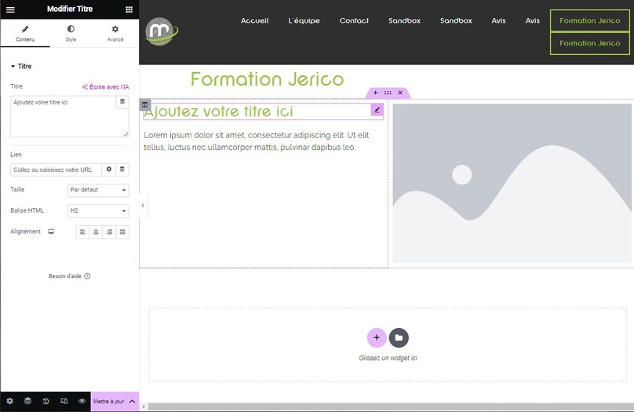

# Elementor : Gérer l'ordre des éléments

Bienvenue dans le guide sur la gestion de l'ordre des éléments avec Elementor ! Avec Elementor, vous avez un contrôle total sur la disposition de votre page.

## Déplacer les sections

Les sections sont les blocs principaux de votre page. Voici comment les déplacer :

1. Repérez les trois points verticaux ( ::: ) qui apparaissent au survol de la section que vous souhaitez déplacer.
2. Cliquez sur ces trois points et maintenez le clic enfoncé.
3. Déplacez la souris vers l'endroit où vous souhaitez déplacer la section, puis relâchez le clic.

:::tips-jerico[Tips]

Les sections se placent toujours les unes au-dessus des autres, vous permettant de réorganiser facilement la structure de votre page.

:::

## Déplacer les widgets

Les widgets sont les éléments individuels à l'intérieur des sections. Voici comment les déplacer :

1. Repérez l'icône du crayon rose située dans le coin supérieur droit du cadre du widget.
2. Cliquez sur cet icône et maintenez le clic enfoncé.
3. Déplacez la souris vers l'emplacement désiré à l'intérieur de la section, puis relâchez le clic.

:::jerico-alert[N'oubliez pas]

Un widget doit toujours être placé à l'intérieur d'une section, mais vous pouvez librement réorganiser leur ordre.

:::

\
Avec ces étapes simples, vous pouvez facilement ajuster l'ordre et la disposition de vos sections et widgets dans Elementor, offrant ainsi une expérience de conception fluide et personnalisée.

Profitez de la liberté créative offerte par Elementor pour créer des pages web magnifiques et fonctionnelles !

Si vous avez des questions ou rencontrez des difficultés, n'hésitez pas à consulter notre documentation supplémentaire ou à contacter notre équipe d'assistance pour obtenir de l'aide.

