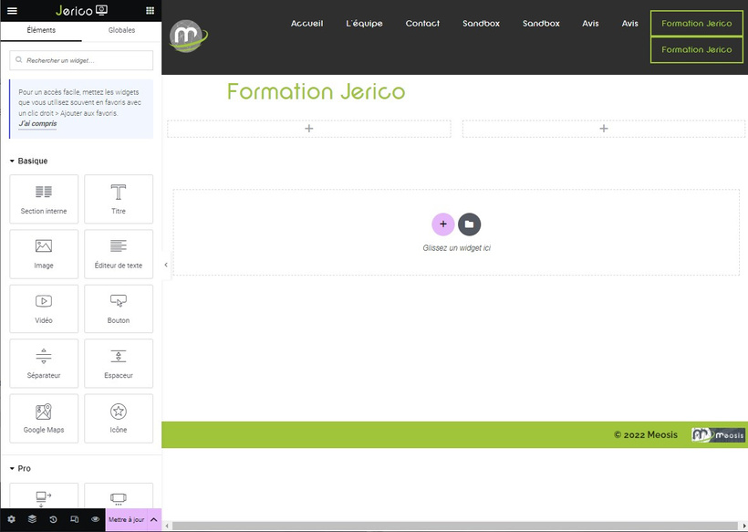

# Elementor : Intégration des widgets dans une section

## Intégration des Widgets

### Comment ajouter du contenu dans une section ?

L'intégration de widgets dans une section avec Elementor est simple et intuitive. Suivez ces étapes :

1. Choisissez la structure de votre section.
2. Repérez les blocs encadrés de rose avec un symbole "+" au milieu.
3. Cliquez sur ce symbole "+" pour afficher la colonne des widgets à gauche.
4. Explorez les widgets disponibles et sélectionnez celui que vous souhaitez intégrer dans votre section.

## Ajout de Widgets

Ajouter des widgets à votre section est facile avec Elementor :

1. Cliquez sur le widget que vous souhaitez ajouter.
2. Maintenez la souris enfoncée et glissez le widget jusqu'à la colonne désirée.
3. Relâchez le bouton de la souris pour déposer le widget.

:::info-jerico[Info]

Vous pouvez ajouter plusieurs widgets dans une colonne, et ils seront affichés les uns en dessous des autres.

:::

\
Pour accéder à la liste complète des widgets, cliquez sur l'icône en haut à droite du panneau de modification à gauche. Par exemple, dans notre exemple, nous avons ajouté un widget "Titre" et un widget "Éditeur de texte" dans la colonne de gauche, et un widget "Image" dans la colonne de droite.

Besoin d'aide supplémentaire ? N'hésitez pas à contacter notre équipe technique à internet@meosis.fr.
