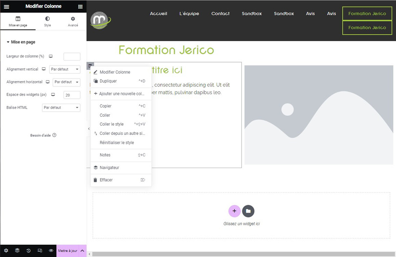

# Elementor : Modifier une section

## Modifier la Section

Les sections sont des éléments essentiels pour structurer votre page. Voici comment les modifier :

### Modifier la Section

Lorsque vous survolez une section que vous avez créée, elle est encadrée en rose et un intercalaire apparaît en haut avec trois symboles :

- **“+”** : Ajouter une nouvelle section.
- **“:::”** : Modifier la section (l'interface de modification s'affiche dans la colonne de gauche).
- **“X”** : Supprimer la section.

## Modifier une Colonne

Vous pouvez également modifier une colonne en effectuant un clic droit en haut à gauche sur l'icône grise. Un menu apparaît ensuite avec différentes options de modification. Vous pouvez par exemple supprimer ou dupliquer la colonne.

Les sections offrent une flexibilité maximale pour personnaliser votre mise en page selon vos besoins. 

Besoin d'aide supplémentaire ? Contactez notre équipe technique à internet@meosis.fr.
