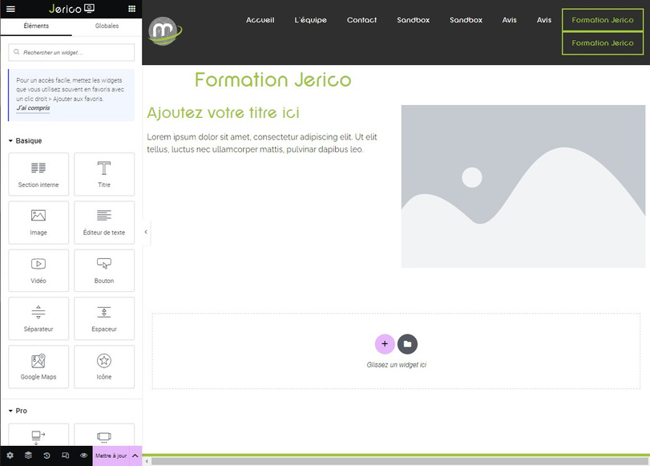

# Elementor : Modifier un widget

## Modifier le contenu d’un widget

Pour modifier le contenu d’un widget, suivez ces étapes simples :

1. Repérez le widget que vous souhaitez modifier sur votre page.
2. Cliquez sur le petit crayon rose situé en haut à droite du bloc widget.
3. Cela ouvrira la colonne de gauche avec les informations du widget et du contenu.
4. Vous verrez trois onglets : Contenu / Style / Avancé. 
5. Effectuez les modifications nécessaires dans cette colonne selon vos besoins.
6. Une fois les modifications terminées, assurez-vous de cliquer sur le bouton "METTRE À JOUR" situé en bas de la colonne. Ce bouton est de couleur rose.

N'hésitez pas à explorer les différentes options offertes dans les onglets Contenu, Style et Avancé pour personnaliser davantage votre widget.

Si vous avez des questions supplémentaires ou rencontrez des difficultés, notre équipe technique est là pour vous aider ! Contactez-nous à internet@meosis.fr.
