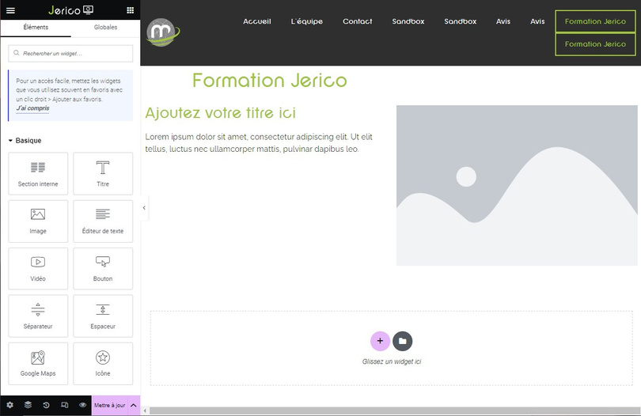

# Elementor : Des outils pour mieux vous retrouver

## Outils Pratiques

Elementor offre une gamme d'outils pratiques pour vous aider à naviguer efficacement dans votre processus de création. Voici un aperçu de ces outils :

- **Réglages** :   Cette icône vous donne accès aux réglages où vous pouvez modifier le titre et l'image principale associée à la page.

- **Navigateur** :  Cette icône représente le navigateur, vous permettant de passer rapidement d'une section à une autre pour apporter des modifications. Vous pouvez activer ou désactiver le navigateur depuis le bouton correspondant en bas à gauche de la page.

- **Historique** :  Cette icône vous permet d'accéder à l'historique des versions précédentes de votre travail. Vous pouvez revenir à une version antérieure en cliquant sur "Révisions".

- **Mode Responsive** :  Cette icône vous permet de visualiser votre page dans différents modes de dispositif, tels que mobile ou tablette, pour vous assurer que votre contenu s'affiche correctement sur chaque support.

- **Prévisualisation** :  Cette icône vous permet de prévisualiser les modifications avant de les mettre à jour ou de publier du contenu, offrant ainsi un aperçu précieux de l'apparence finale de votre page.

En outre, vous pouvez interagir avec vos pages en utilisant le menu "burger"  (les 3 traits horizontaux situés en haut à gauche, à côté de "Jerico"). En suivant le lien "Voir la page", vous pouvez consulter votre page. En cliquant sur "Quitter", vous revenez à la plateforme Jerico, comme avant de commencer l'édition de la page en cours.

Ces outils vous offrent un contrôle complet sur votre processus de création dans Elementor, vous permettant de travailler de manière efficace et de visualiser facilement les changements apportés à votre page.

Pour toute question ou assistance supplémentaire, n'hésitez pas à contacter notre service technique à internet@meosis.fr.
