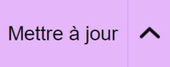

# Elementor en quelques mots

Elementor simplifie la création de sites web avec les fonctionnalités suivantes :

1. **Structuration par Sections** : Elementor organise votre contenu en sections, offrant une approche intuitive pour concevoir votre page.

2. **Personnalisation des Widgets** : Les widgets constituent les éléments de votre page. Vous pouvez les modifier en cliquant sur le crayon en haut à droite de leur cadre, puis effectuer les modifications dans le menu de gauche.

3. **Enregistrement des Modifications** : Avant de quitter la page, assurez-vous de cliquer sur le bouton rose  pour enregistrer toutes les modifications apportées.

Elementor offre ainsi une interface conviviale et des fonctionnalités puissantes pour créer des sites web attrayants et fonctionnels sans nécessiter de compétences en programmation.

Pour des conseils supplémentaires ou une assistance personnalisée, n'hésitez pas à contacter notre équipe technique à internet@meosis.fr.
