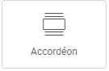

# Elementor : Widget Accordéon

## Les Widgets

Les widgets sont des éléments de blocs déplaçables qui permettent de personnaliser votre page selon vos besoins. Le widget Accordéon, similaire au widget Liste de prix, fonctionne sur le même principe. En cliquant sur "Accordéon #X", vous pouvez modifier le contenu affiché. 

### Utilisations courantes

Le widget Accordéon est particulièrement utile pour les Foires Aux Questions (FAQ). Il offre une manière élégante de répondre aux questions des visiteurs de votre site. En cliquant sur "Accordéon #X" dans l'interface de modification, vous pouvez facilement éditer le titre et le texte de chaque accordéon.

Pour toute question supplémentaire ou assistance, n'hésitez pas à contacter notre équipe technique à internet@meosis.fr.
