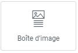
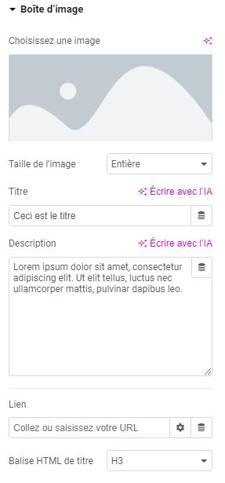

# Elementor : Widget Boîte d’image

## Les Widgets

Les widgets sont des éléments de blocs déplaçables qui vous permettent de personnaliser votre page selon vos besoins. Le widget Boîte d’image est conçu pour mettre en avant un contenu spécifique en éditant son titre, sa description et le lien vers lequel l’image pointe (s'il y en a un).

### Utilisations courantes

Le widget Boîte d’image est idéal pour mettre en avant vos dernières sorties ou vos produits phares. Il combine les fonctionnalités de plusieurs widgets déjà vus, vous permettant d'éditer tous les contenus à la manière d'Image, Texte et Titre en cliquant dessus.

N'hésitez pas à explorer les possibilités offertes par le widget Boîte d’image pour créer des mises en page attrayantes et captivantes.

Pour toute question supplémentaire ou assistance, n'hésitez pas à contacter notre équipe technique à internet@meosis.fr.
