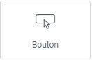
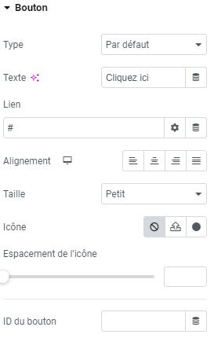

# Elementor : Widget Bouton

## Les Widgets

Les widgets sont des éléments de blocs déplaçables qui vous permettent de personnaliser votre page selon vos besoins. Le widget Bouton est un outil puissant pour encourager l'interaction de vos visiteurs avec votre site.

### Utilisations courantes

Le Bouton est particulièrement utile pour inciter vos visiteurs à effectuer des actions spécifiques, telles que :

- Naviguer vers une page de contact
- Télécharger un fichier
- Souscrire à une newsletter

### Personnalisation du Bouton

Pour personnaliser votre bouton, suivez ces étapes simples :

1. Cliquez sur le champ "Lien" et collez l'adresse de la page vers laquelle vous souhaitez diriger vos visiteurs.
2. Explorez les options de personnalisation disponibles, telles que la couleur, la taille et le style du bouton.

:::tips-jerico[N'hésitez pas !]

N'hésitez pas à explorer et à expérimenter avec les différents widgets que propose l'outil Elementor. Laissez libre cours à votre créativité pour créer des mises en page uniques et attrayantes. 

:::

\
Pour toute question supplémentaire ou assistance, n'hésitez pas à contacter notre équipe technique à internet@meosis.fr.
