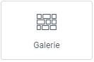
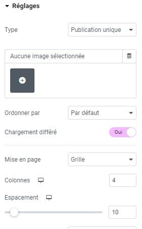

# Elementor : Widget Galerie

## Les Widgets

Les widgets sont des éléments de blocs déplaçables qui vous permettent de personnaliser votre page selon vos besoins. Le widget Galerie est un outil puissant pour afficher plusieurs images à la fois sur une partie de votre page.

### Utilisations courantes

Le widget Galerie est idéal pour présenter des portfolios, des galeries d'images, des témoignages clients, ou tout autre contenu visuel que vous souhaitez mettre en avant sur votre site.

### Intégration de contenu depuis la médiathèque

Si votre contenu se trouve déjà dans votre médiathèque WordPress, vous pouvez facilement l'intégrer dans votre galerie en quelques clics. Sinon, vous pouvez télécharger de nouvelles images directement depuis votre ordinateur.

### Personnalisation de la Galerie

Explorez les options de personnalisation disponibles pour ajuster l'apparence de votre galerie, telles que la disposition des images, les marges, les effets de transition, etc.

:::tips-jerico[N'hésitez pas !]

N'hésitez pas à explorer et à expérimenter avec les différents widgets que propose l'outil Elementor. Laissez libre cours à votre créativité pour créer des mises en page uniques et attrayantes. 

:::

\
Pour toute question supplémentaire ou assistance, n'hésitez pas à contacter notre équipe technique à internet@meosis.fr.
