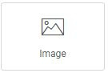
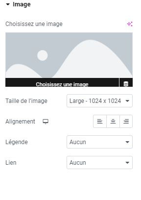

# Elementor : Widget Image

## Les Widgets

Les widgets sont des éléments de blocs déplaçables qui vous permettent de personnaliser votre page selon vos envies. Le widget Image est l'un des widgets les plus utilisés, et il est essentiel pour enrichir visuellement votre contenu.

### Utilisations courantes

Le widget Image vous permet d'ajouter et d'éditer des photos ou des images sur votre page. Il est recommandé d'approvisionner vos pages en contenus visuels afin d'accompagner vos textes et d'attirer l'attention de vos visiteurs.

### Ajout d'une image

Pour ajouter une image, suivez ces étapes simples :

1. Cliquez sur le menu "Choisissez une image" situé à gauche.
2. Sélectionnez l'image depuis votre médiathèque WordPress ou téléchargez une nouvelle image depuis votre ordinateur en la glissant et en la déposant directement sur votre site Internet.

### Personnalisation de l'image

Explorez les options de personnalisation disponibles pour ajuster l'apparence de votre image, telles que la taille, l'alignement, les marges, etc.

:::tips-jerico[N'hésitez pas !]

N'hésitez pas à explorer et à expérimenter avec les différents widgets que propose l'outil Elementor. Laissez libre cours à votre créativité pour créer des mises en page uniques et attrayantes. 

:::

\
Pour toute question supplémentaire ou assistance, n'hésitez pas à contacter notre équipe technique à internet@meosis.fr.
