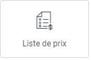
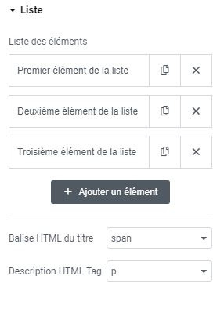

# Elementor : Widget Liste de prix

## Les Widgets

Les widgets sont des éléments de blocs déplaçables qui vous permettent de personnaliser votre page selon vos envies. Le widget Liste de prix est un outil polyvalent qui vous permet d'afficher le nom de vos produits, leur description et leur prix sur votre page.

### Utilisations courantes

La Liste de prix est idéale pour présenter les caractéristiques et les tarifs de vos produits ou services. Vous pouvez personnaliser chaque élément de la liste en cliquant sur les menus "Xème élément de la liste".

### Possibilités créatives

Avec un peu de créativité, vous pouvez utiliser le widget Liste de prix pour créer une carte de restaurant, une frise chronologique ou tout autre élément visuel adapté à vos besoins.

### Personnalisation de la Liste de prix

Explorez les options de personnalisation disponibles pour ajuster l'apparence de votre Liste de prix, telles que la mise en page, les couleurs, les polices, etc.

:::tips-jerico[N'hésitez pas !]

N'hésitez pas à explorer et à expérimenter avec les différents widgets que propose l'outil Elementor. Laissez libre cours à votre créativité pour créer des mises en page uniques et attrayantes. 

:::

\
Pour toute question supplémentaire ou assistance, n'hésitez pas à contacter notre équipe technique à internet@meosis.fr.
