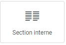
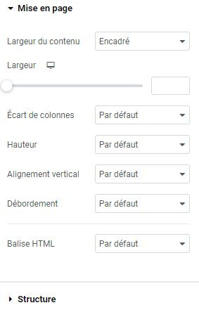

# Elementor : Widget Section interne

## Les Widgets

Les widgets sont des éléments de blocs déplaçables qui vous permettent de personnaliser votre page selon vos envies. Le widget Section interne est un outil puissant qui vous permet d'organiser hiérarchiquement vos contenus.

### Utilisations courantes

Le widget Section interne vous permet de créer des sections au sein d'autres sections. Par exemple, vous pouvez placer une section interne de 4 colonnes dans une section de 2 colonnes, ce qui offre une grande flexibilité dans la mise en page de votre site.

### Utilisation du widget

Pour utiliser le widget Section interne, suivez ces étapes simples :

1. Glissez et déposez le widget Section interne sur votre page.
2. Placez-le à l'intérieur d'une section existante.

### Personnalisation de la Section interne

Explorez les options de personnalisation disponibles pour ajuster l'apparence et la disposition de votre section interne, telles que le nombre de colonnes, les marges, les espacements, etc.

:::tips-jerico[N'hésitez pas !]

N'hésitez pas à explorer et à expérimenter avec les différents widgets que propose l'outil Elementor. Laissez libre cours à votre créativité pour créer des mises en page uniques et attrayantes. 

:::

\
Pour toute question supplémentaire ou assistance, n'hésitez pas à contacter notre équipe technique à internet@meosis.fr.
