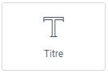
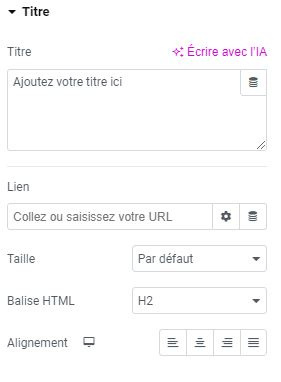

# Elementor : Widget Titre

## Les Widgets

Les widgets sont des éléments de blocs déplaçables qui vous permettent de personnaliser votre page selon vos envies. Le widget Titre est un outil essentiel pour organiser le contenu de vos pages en sous-parties ou pour mettre en avant des titres accrocheurs.

### Utilisation du widget

Le widget Titre peut être utilisé pour titrer vos paragraphes, organiser vos sections ou mettre en évidence des informations importantes sur votre page. Placez ce bloc de préférence avant le widget Éditeur de texte pour un effet visuel efficace.

### Personnalisation du titre

Pour éditer votre titre, cliquez simplement sur le bloc et modifiez-le comme vous éditeriez du texte. Explorez les options de personnalisation disponibles pour ajuster le style, la taille, la couleur et la mise en forme de votre titre.

:::tips-jerico[N'hésitez pas !]

N'hésitez pas à explorer et à expérimenter avec les différents widgets que propose l'outil Elementor. Laissez libre cours à votre créativité pour créer des mises en page uniques et attrayantes. 

:::

\
Pour toute question supplémentaire ou assistance, n'hésitez pas à contacter notre équipe technique à internet@meosis.fr.
