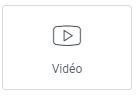
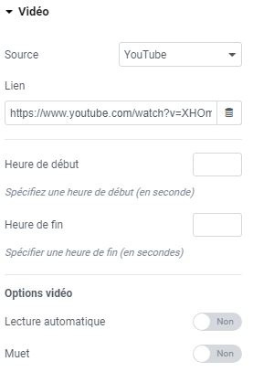

# Elementor : Widget Vidéo

## Les Widgets

Les widgets sont des éléments de blocs déplaçables qui vous permettent de personnaliser votre page selon vos envies. Le widget Vidéo vous offre la possibilité d'afficher des vidéos de différentes sources sur votre page.

### Utilisation du widget

Le widget Vidéo vous permet d'afficher des vidéos à partir de différentes sources telles que YouTube, Vimeo, ou tout autre lien vidéo. Vous pouvez contrôler la taille, l'affichage, la lecture et le son de la vidéo selon vos préférences.

### Affichage de votre propre vidéo

Pour afficher votre propre vidéo, éditez le lien dans le widget et insérez-y le lien de votre vidéo. Assurez-vous d'utiliser un format de lien compatible avec le widget Vidéo.

### Personnalisation de la vidéo

Explorez les options de personnalisation disponibles pour ajuster l'apparence et le comportement de votre vidéo. Vous pouvez modifier la taille, la disposition, les contrôles de lecture, le volume, etc.

:::tips-jerico[N'hésitez pas !]

N'hésitez pas à explorer et à expérimenter avec les différents widgets que propose l'outil Elementor. Laissez libre cours à votre créativité pour créer des mises en page uniques et attrayantes. 

:::

\
Pour toute question supplémentaire ou assistance, n'hésitez pas à contacter notre équipe technique à internet@meosis.fr.
