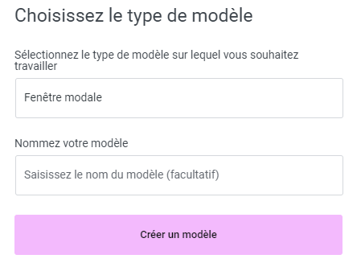
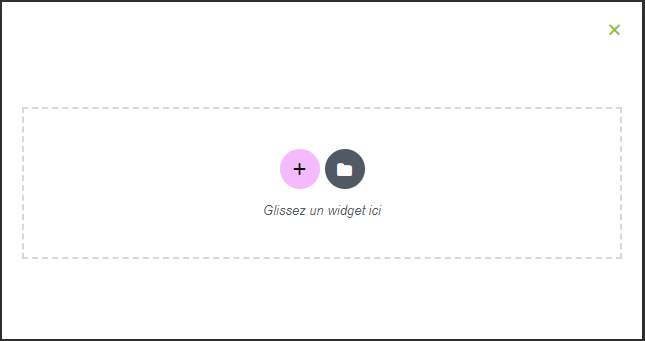

## Trouver un nom avec du sens

### L’édition de la Popup (1)

En créant une nouvelle popup, vous pouvez choisir un nom. Nous vous conseillons de nommer la popup en fonction de l’utilisation que vous allez en faire. Ex. : « Vacances », « Promotions », etc. De cette façon, vous pourrez réutiliser le même modèle en changeant un minimum d’information sur les dates ou les prix.

Lorsque vous créez une nouvelle popup, il est important de lui donner un nom significatif. Nous vous recommandons de choisir un nom en fonction de l'utilisation prévue pour la popup, par exemple "Offres spéciales", "Newsletter", "Promotions", etc. Cela vous permettra de mieux vous repérer dans vos créations et de réutiliser facilement le même modèle en adaptant uniquement les informations spécifiques, telles que les dates ou les prix.

La logique de mise en forme de la popup est similaire à celle des pages. En effet, c’est grâce aux widgets elementor que vous pourrez créer votre modèle.

Les popups : un outil pratique pour communiquer avec vos clients et prospects.

La logique de mise en forme de la popup est similaire à celle des pages. Vous pouvez utiliser les widgets Elementor pour personnaliser le contenu et la mise en page de votre popup selon vos besoins et vos préférences.

Pour toute question supplémentaire ou assistance, n'hésitez pas à contacter notre équipe technique à internet@meosis.fr.
