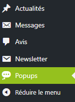
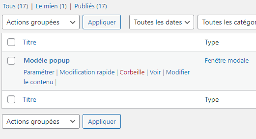
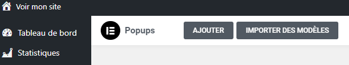

## Gérer un modèle rapidement

### Gérer une popup

Les popups : un outil pratique pour communiquer avec vos clients et prospects.

Pour gérer vos popups, suivez ces étapes simples :

1. Dans le menu de gauche, sélectionnez l'onglet "Popups".
2. Vous pourrez alors ajouter, modifier ou supprimer une ou plusieurs popups en fonction de vos besoins.

### Naviguer dans le sommaire

#### La liste des popups

:::info-jerico[liste des "Popups"]

Après avoir cliqué sur l'onglet "Popups", vous verrez la liste de tous les modèles que vous avez créés. Vous pouvez facilement modifier le contenu ou supprimer une popup en survolant celle-ci et en choisissant parmi les options qui apparaissent.

:::

## Un ajout en un seul clic

### Ajouter une popup

Les popups : un outil pratique pour communiquer avec vos clients et prospects.

Pour ajouter une nouvelle popup, suivez ces étapes simples :

1. Cliquez sur l'option "Ajouter" en haut de la page, comme indiqué sur l'image ci-contre.

Cette méthode rapide vous permet d'ajouter efficacement de nouvelles popups à votre site.

Pour toute question supplémentaire ou assistance, n'hésitez pas à contacter notre équipe technique à internet@meosis.fr.
