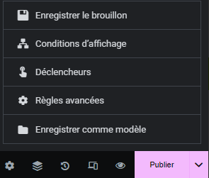
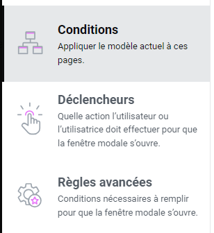
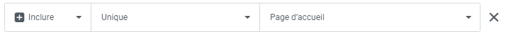
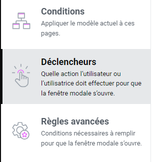
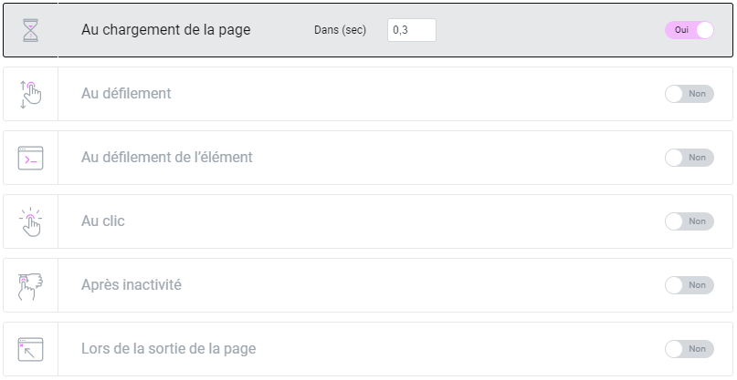
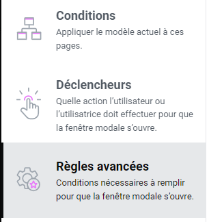
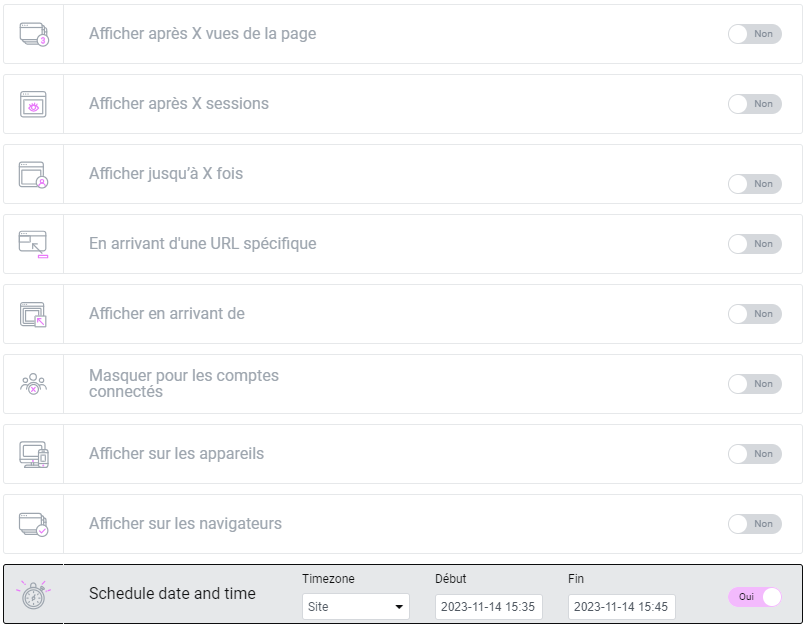

## Apparition et suppression automatique des Popups

### Programmation de la Popup (1)

Pour programmer votre popup, suivez ces étapes :

1. Rendez-vous dans les paramétrages en cliquant sur la flèche en bas à gauche.
2. Sélectionnez "Conditions d'affichage".

### Programmation de la Popup (2)

Dans la fenêtre des paramètres, vous trouverez trois catégories sur la gauche. Vous serez automatiquement dirigé vers la partie "Conditions" où vous pourrez choisir sur quelle page la popup apparaîtra.

### Programmation de la Popup (3)

Il est recommandé d'inclure votre popup sur la page d'accueil uniquement, comme indiqué dans l'exemple ci-dessus.

### Programmation de la Popup (4)

Ensuite, dans la section "Déclencheurs", déterminez l'action qui initiéra l'apparition de la popup.

### Programmation de la Popup (5)

Nous vous conseillons de sélectionner le chargement de la page comme déclencheur principal, en ajoutant un temps de chargement si nécessaire.

### Programmation de la Popup (6)

Enfin, dans la catégorie "Règles avancées", vous pouvez déterminer la date de début et de fin d'affichage de votre popup.

### Programmation de la Popup (7)

Au bas des options, vous trouverez la ligne "Schedule date and time". Utilisez cette fonction pour programmer la date et l'heure de début et de fin d'affichage de votre popup.

Pour toute question supplémentaire ou assistance, n'hésitez pas à contacter notre équipe technique à internet@meosis.fr.
