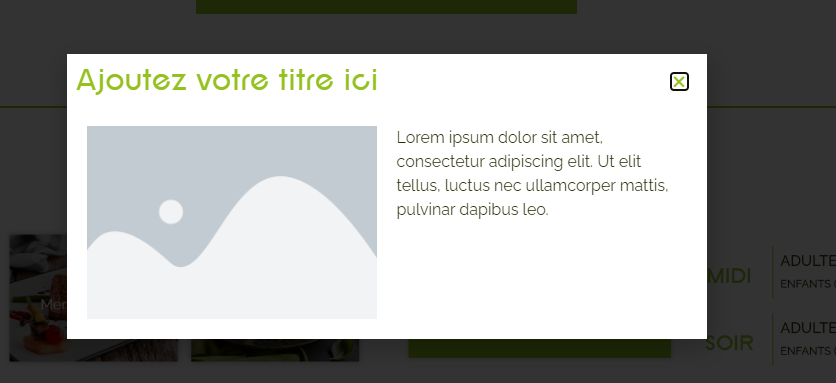

# Les Popups : Communiquer avec Impact

## Un outil pratique pour engager vos clients et prospects.

Les popups, également connues sous le nom de fenêtres surgissantes, sont des éléments visuels qui s'affichent à l'avant des pages de votre site. Elles sont une solution efficace pour communiquer des informations ponctuelles ou exceptionnelles telles que des promotions, des événements spéciaux ou des offres exclusives.

### Les Avantages des Popups pour l'Expérience Utilisateur (UX) :

- **Information Immédiate :** Les popups offrent une visibilité instantanée aux informations importantes, permettant aux utilisateurs de ne pas les manquer.
- **Engagement Direct :** Elles captent l'attention de vos visiteurs, les incitant à prendre des mesures telles que s'inscrire à une newsletter, profiter d'une offre spéciale, ou explorer une nouvelle fonctionnalité.
- **Personnalisation :** Vous pouvez adapter le contenu des popups en fonction du comportement de l'utilisateur ou de ses préférences, offrant ainsi une expérience plus personnalisée.

### Conseils pour des Popups Efficaces :

1. **Clarté et Pertinence :** Assurez-vous que le message de la popup est clair et pertinent pour votre audience.
2. **Fréquence de l'Affichage :** Utilisez les popups de manière judicieuse pour ne pas perturber l'expérience de l'utilisateur.
3. **Appel à l'Action Convaincant :** Incitez les visiteurs à agir en utilisant des appels à l'action convaincants et incitatifs.

Les popups peuvent être un outil puissant pour améliorer l'engagement et les conversions sur votre site web. Pour toute question supplémentaire sur la création ou la gestion des popups, n'hésitez pas à contacter notre équipe d'assistance à internet@meosis.fr.
