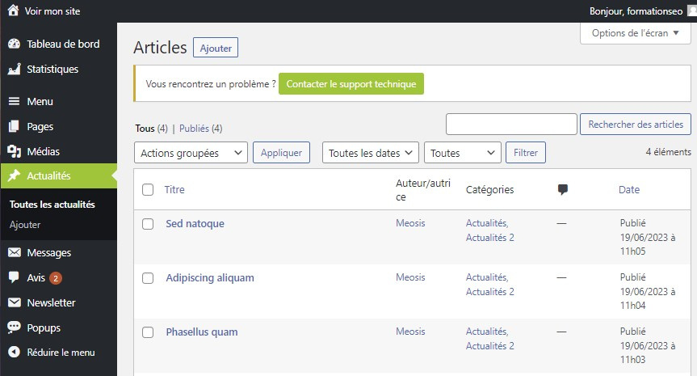

# Découverte de l’onglet Actualités : Restez Connecté avec vos Visiteurs

L’onglet Actualités est un outil essentiel pour tenir vos visiteurs informés des dernières nouvelles, mises à jour ou événements concernant votre site. Voici comment tirer le meilleur parti de cette fonctionnalité.

## Vue d'Ensemble

### Gestion des Actualités

L'onglet Actualités vous permet de maintenir un flux d'informations dynamique sur votre site. Voici quelques actions que vous pouvez effectuer :

- **Ajouter des Articles :** Créez de nouveaux articles pour partager des informations importantes ou intéressantes avec votre audience.
- **Modifier les Actualités :** Mettez à jour et modifiez vos articles existants pour refléter les dernières informations ou corrections.
- **Planification des Publications :** Programmez la publication de vos articles pour qu'ils apparaissent à des moments stratégiques.

### Interaction avec vos Visiteurs

Les actualités ne sont pas seulement des informations à sens unique. Elles offrent également une opportunité d'engagement avec vos visiteurs :

- **Commentaires :** Activez la fonction de commentaires pour permettre à vos visiteurs de réagir et de partager leurs opinions sur vos articles.
- **Partage Social :** Facilitez le partage de vos actualités en intégrant des boutons de partage sur les réseaux sociaux.

### Promotion de Contenu

Utilisez l'onglet Actualités pour promouvoir divers types de contenu :

- **Nouveautés Produits :** Annoncez les derniers produits ou services que vous proposez.
- **Événements :** Informez vos visiteurs des événements à venir, tels que des webinaires, des promotions spéciales ou des conférences.
- **Articles de Blog :** Intégrez vos articles de blog pour attirer plus de trafic vers votre site et renforcer votre autorité dans votre domaine.

Que vous soyez une entreprise, un blogueur ou une organisation à but non lucratif, l'onglet Actualités est un outil précieux pour rester connecté avec votre audience et partager des informations importantes. Explorez ses fonctionnalités et utilisez-le pour dynamiser votre présence en ligne !
