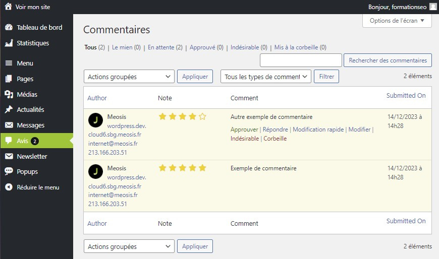

# Découverte de l’onglet Avis : Écoutez et Interagissez avec vos Clients

L'onglet Avis est un outil puissant pour recueillir et gérer les retours de vos clients sur votre site. Voici comment tirer parti de cette fonctionnalité pour améliorer votre relation client.

## Vue d'Ensemble

### Gestion des Avis Clients

L'onglet Avis vous permet de surveiller et de répondre aux avis laissés par vos clients. Voici ce que vous pouvez faire :

- **Validation des Nouveaux Avis :** Apprenez à valider les nouveaux avis pour qu'ils apparaissent sur votre site.
- **Modification des Avis :** Découvrez comment corriger les fautes d'orthographe ou mettre à jour les avis existants.
- **Réponses aux Avis :** Interagissez avec vos clients en leur répondant directement depuis l'onglet Avis.

### Interaction Client

Les avis ne sont pas seulement des commentaires passifs ; ils offrent également une occasion d'engagement avec vos clients :

- **Transparence et Confiance :** Montrez à vos clients que vous appréciez leurs retours en répondant à leurs avis, ce qui renforce la confiance dans votre marque.
- **Résolution des Problèmes :** Utilisez les avis comme une opportunité pour résoudre les problèmes signalés par vos clients et améliorer ainsi leur expérience.

### Optimisation de l'Expérience Client

Utilisez les avis pour comprendre les besoins et les préoccupations de vos clients :

- **Feedback Produit :** Identifiez les points forts et les points faibles de vos produits ou services grâce aux commentaires des clients.
- **Amélioration Continue :** Utilisez les retours pour apporter des améliorations constantes à vos offres et maintenir la satisfaction client.

L'onglet Avis est bien plus qu'un simple outil de gestion des commentaires ; il s'agit d'un moyen puissant d'écouter vos clients, de renforcer votre relation avec eux et d'améliorer constamment votre entreprise. Explorez ses fonctionnalités et utilisez-le pour offrir une expérience client exceptionnelle !
