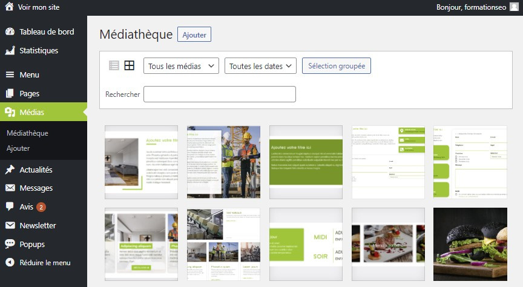

# Découverte de l’Onglet Médias : Gestion Efficace de vos Ressources Visuelles

L'onglet Médias constitue le cœur de votre médiathèque, où vous pouvez stocker et gérer tous les fichiers visuels de votre site. Explorez ses fonctionnalités pour optimiser la gestion de vos médias.

## Gestion des Médias

### Ajout et Organisation

Apprenez à ajouter des images, vidéos et autres fichiers à votre médiathèque :

- **Importation d'Images :** Découvrez comment ajouter des images à votre médiathèque pour les utiliser sur vos pages.
- **Structuration des Ressources :** Organisez vos médias en dossiers pour une gestion plus efficace.

## Utilisation des Médias

### Intégration dans vos Contenus

Une fois vos médias importés, vous pouvez les utiliser directement dans la construction de vos pages :

- **Intégration avec Elementor :** Utilisez vos médias dans l'outil Elementor pour créer des mises en page dynamiques et attrayantes.

## Conseils Pratiques

### Optimisation des Images

Assurez-vous que vos images respectent les normes de taille et de poids recommandées :

- **Limite de Poids :** Notez qu'il existe une limite de poids pour les images. Utilisez des outils en ligne pour compresser vos images avant de les importer.

L'onglet Médias est un outil essentiel pour gérer efficacement vos ressources visuelles. Explorez ses fonctionnalités pour tirer le meilleur parti de votre médiathèque et enrichir votre site avec des contenus visuellement attractifs.
