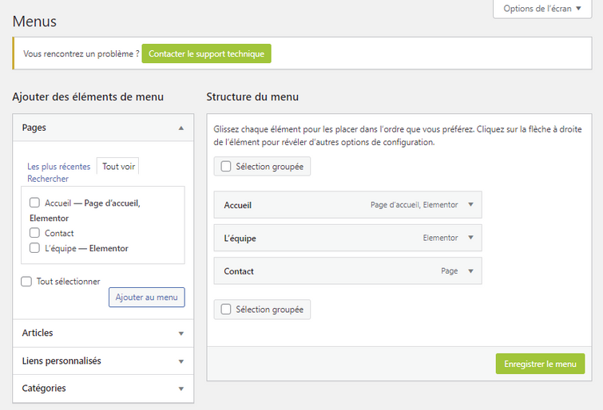

# Découverte de l'Onglet Menu : Personnalisation de la Navigation de votre Site

L'onglet Menu vous permet de contrôler le contenu et l'organisation de la barre de navigation de votre site. Découvrez comment personnaliser votre menu pour offrir une expérience de navigation fluide à vos utilisateurs.

## Personnalisation du Menu

### Ajout et Organisation des Éléments

Commencez par sélectionner les pages et les liens que vous souhaitez inclure dans votre menu :

- **Ajout d'Éléments :** Dans le cadre de gauche, utilisez l'option "Ajouter des éléments de menu" pour sélectionner les pages et les liens à inclure.
- **Organisation des Éléments :** Dans le cadre de droite, structurez votre menu en faisant glisser les éléments pour définir leur ordre et leur hiérarchie.

## Enregistrement des Modifications

### Sauvegarde et Publication

:::jerico-alert[Rappel]

Une fois vos modifications apportées, n'oubliez pas de les enregistrer pour les rendre effectives sur votre site.
**Enregistrer le Menu :** Cliquez sur le bouton "Enregistrer le menu" pour sauvegarder vos changements et les appliquer à votre site.

:::

\
L'onglet Menu offre un contrôle complet sur la navigation de votre site, vous permettant de créer une expérience utilisateur optimale. Explorez ses fonctionnalités pour personnaliser votre menu selon les besoins de votre site.
