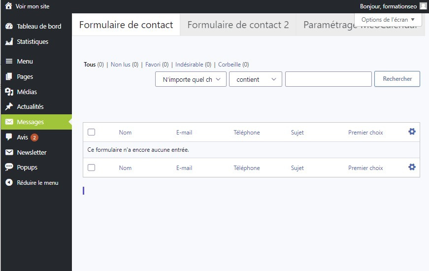

# Découverte de l'Onglet Messages : Gestion des Prises de Contact

L'onglet Messages vous permet de consulter et de gérer toutes les prises de contact effectuées via le formulaire de contact de votre site. Explorez cette fonctionnalité pour rester en contact avec vos visiteurs et répondre à leurs demandes.

## Visualisation des Messages

### Consultation des Prises de Contact

Dans l'onglet Messages, accédez à toutes les informations envoyées par vos visiteurs via le formulaire de contact de votre site. Ces messages sont également envoyés à l'adresse e-mail que vous avez spécifiée lors du développement de votre site.

## Gestion des Messages

### Traitement des Demandes

Utilisez l'onglet Messages pour répondre aux demandes de vos visiteurs de manière efficace et professionnelle. Vous pouvez trier, filtrer et répondre aux messages directement depuis cette interface, offrant ainsi un service client de qualité.

L'onglet Messages est un outil essentiel pour maintenir une communication fluide avec vos utilisateurs et répondre à leurs besoins de manière proactive. Explorez ses fonctionnalités pour améliorer l'engagement de vos visiteurs et renforcer la réputation de votre site.
