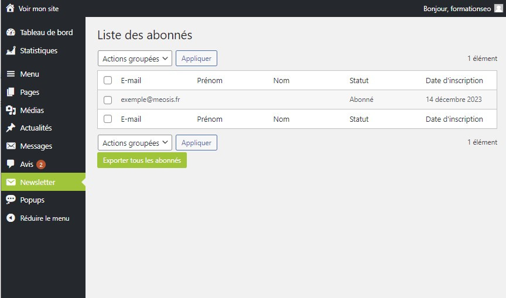

# Découverte de l'Onglet Newsletter : Gestion des Abonnés

L'onglet Newsletter vous offre un aperçu complet de la liste des e-mails collectés grâce à l'outil de récolte d'e-mails intégré à votre site. Explorez cette fonctionnalité pour rester en contact avec votre audience et développer votre liste d'abonnés.

## Consultation des Abonnés

### Visualisation de la Liste d'E-mails

Dans l'onglet Newsletter, accédez à la liste complète des visiteurs ayant exprimé leur intérêt à rester en contact avec votre entreprise. Ces adresses e-mail sont collectées via un formulaire d'inscription ou tout autre mécanisme de récolte d'e-mails intégré à votre site.

## Gestion des Abonnés

### Interaction avec les Abonnés

Utilisez l'onglet Newsletter pour interagir avec vos abonnés, leur envoyer des newsletters périodiques ou leur transmettre des informations importantes sur votre entreprise. Vous pouvez également segmenter votre liste d'abonnés et personnaliser vos communications pour une expérience plus ciblée.

L'onglet Newsletter constitue un outil précieux pour maintenir l'engagement de votre audience et développer votre présence en ligne. Explorez ses fonctionnalités pour tirer le meilleur parti de votre liste d'abonnés et renforcer votre relation avec vos clients potentiels.
