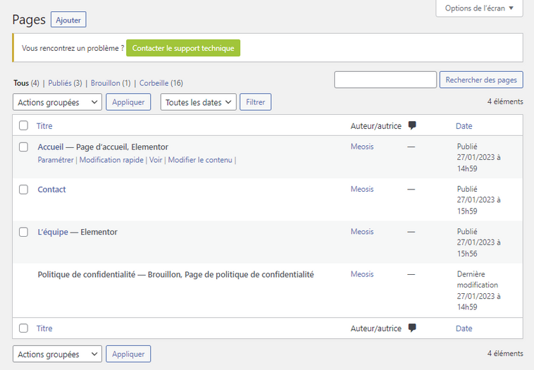
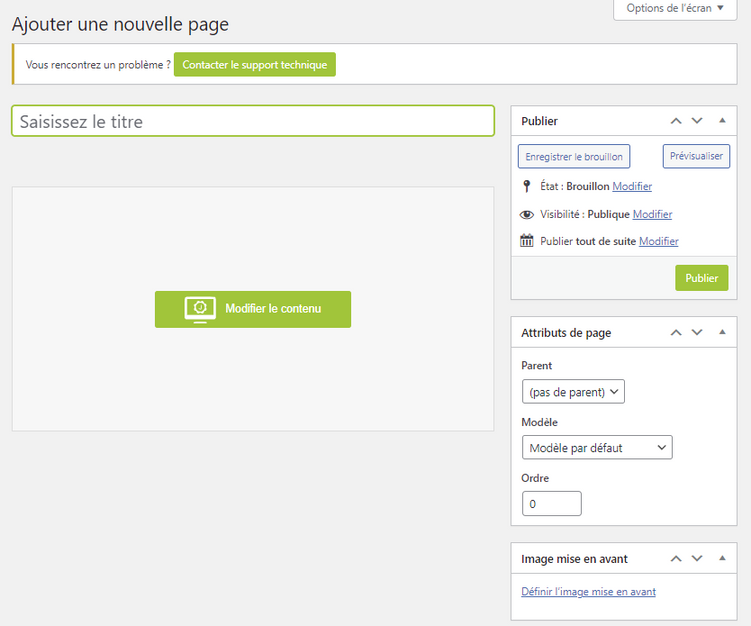

# Découverte de l'Onglet Pages : Gestion des Pages

L'onglet Pages vous permet de gérer facilement toutes les pages de votre site web. Explorez cette section pour modifier le contenu des pages existantes ou créer de nouvelles pages selon vos besoins.

## Modification des Pages Existantes

### Modifier le Contenu d'une Page

Pour modifier le contenu d'une page existante, survolez le titre de la page dans la liste, puis cliquez sur "Modifier le contenu" qui apparaît dans le menu sous le titre. Cela ouvre la page dans l'outil de création de pages Elementor, où vous pouvez effectuer les modifications nécessaires.

## Création de Nouvelles Pages

### Créer une Nouvelle Page

Pour créer une nouvelle page et l'ajouter à votre site, cliquez sur le bouton "Ajouter". Cela ouvrira l'outil de création de pages.

#### Dans l'Outil de Création de Page

1. Ajoutez un titre à votre nouvelle page.
2. Cliquez sur "Enregistrer le brouillon" pour enregistrer le titre de la page.
3. Ensuite, cliquez sur le bouton vert "Modifier le contenu" pour ouvrir la nouvelle page dans Elementor, où vous pouvez commencer à concevoir le contenu de la page.

L'onglet Pages offre un moyen convivial de gérer la structure et le contenu de votre site web. Que vous souhaitiez modifier le contenu existant ou créer de nouvelles pages, cet outil facilite grandement le processus.
