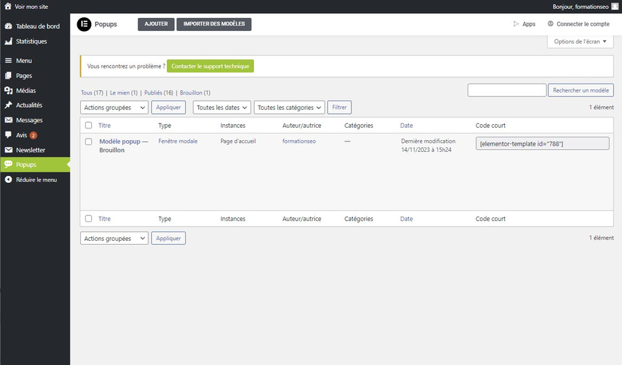

# Découverte de l'Onglet Popups : Gestion des Popups

L'onglet Popups vous permet de créer des fenêtres surgissantes qui s'afficheront en premier plan lorsque les visiteurs chargent la page d'accueil de votre site. Ces popups sont idéales pour afficher des informations importantes et temporaires telles que les congés ou les promotions.

## Création et Édition des Popups

### Pourquoi Utiliser les Popups

Les popups sont efficaces pour communiquer rapidement des messages temporaires.

### Création de Nouvelles Popups

Pour créer une nouvelle popup :

1. Cliquez sur "Ajouter Popup" dans le menu.
2. Donnez un nom à votre popup.
3. Configurez le contenu et le style de votre popup en utilisant l'éditeur intégré.

### Édition des Popups Existantes

Pour modifier une popup existante :

1. Sélectionnez la popup que vous souhaitez modifier dans la liste des popups.
2. Modifiez le contenu ou le style selon vos besoins à l'aide de l'éditeur.

L'onglet Popups vous offre un moyen pratique de créer et de gérer des messages temporaires qui captent rapidement l'attention de vos visiteurs.
