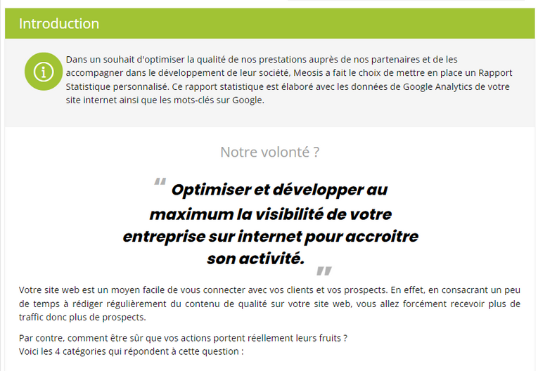

# Découverte de l'Onglet Statistiques : Analyse des Performances du Site

## Statistique du Back Office Web

La page "Statistique" du Back Office Web fournit un aperçu détaillé des performances de votre site internet. Elle vous permet de comprendre en profondeur comment votre site est utilisé par vos visiteurs et comment il se positionne sur les moteurs de recherche.

### Notre Volonté

L'objectif principal du Back Office Web est d'optimiser et de développer la visibilité de votre entreprise sur internet afin d'accroître son activité. Cette section de la page met en avant l'importance de la présence en ligne et de la production de contenu de qualité pour attirer plus de visiteurs et de prospects.

### Sommaire

Le sommaire fournit une vue d'ensemble des différentes sections de la page Statistique. Chaque section est conçue pour fournir des informations spécifiques sur l'audience du site, son acquisition, son comportement, son référencement et une conclusion sur les performances globales.

### Sections Principales

- **Audience**: Cette section fournit des données sur les visiteurs du site, telles que la récurrence des visites, le nombre de sessions, les pages par session et la durée moyenne des sessions.
- **Acquisition**: Elle donne un aperçu de la provenance des visiteurs, que ce soit via les moteurs de recherche, les références externes, les réseaux sociaux ou le nom de domaine.
- **Comportement**: Cette section analyse les pages les plus consultées et offre des conseils pour optimiser le contenu du site afin de répondre aux besoins des visiteurs.
- **Référencement**: Elle examine les positions des mots-clés sur Google et fournit des recommandations pour améliorer le classement du site.
- **Conclusion**: Enfin, cette section dresse un bilan des performances du site au cours des derniers mois.

:::tips-jerico[Astuces]

Chaque section est accompagnée d'astuces pratiques pour aider à améliorer les performances du site. Ces astuces comprennent des conseils sur la mise à jour régulière du site, l'optimisation de l'ergonomie, la communication visuelle, la fidélisation des visiteurs et la gestion de la notoriété en ligne.

:::

\
En résumé, la page Statistique du Back Office Web offre un aperçu complet et pratique des performances de votre site internet, ainsi que des conseils utiles pour son amélioration continue.